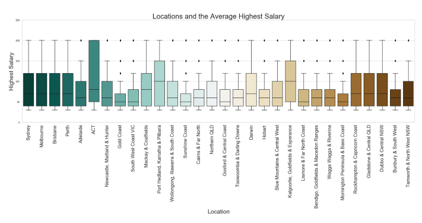

# Data Analytics: SEEK Job Market Analysis

## Overview
This project focuses on analyzing the SEEK job market dataset using data analytics tools. The assignment involves data preparation, preprocessing, understanding, visualization, and analysis to uncover insights about the job market.

The primary dataset is provided in CSV format (`data.csv`) and contains details about job postings on seek.com.au. Additional data crawling is optional. The tasks are divided into multiple parts, emphasizing data exploration, visualization, and actionable insights.

| Job Classification                       | Market by Location                      | Keywords                     |
|-----------------------------------|-------------------------------------|
|  |  |  |

=======

| Trends                      | Trends                     |
|-----------------------------------|-------------------------------------|
|  |  |

## Tasks

### Part 1: Data Preparation and Preprocessing
This part involves understanding and cleaning the dataset to ensure readiness for analysis:
- **Dataset Description:**
  - Types of columns, value ranges, record count, date coverage, locations, job sectors, sub-sectors, salary ranges, and job types.
- **Data Cleaning:**
  - Calculate "AverageSalary" for each job.
  - Normalize and clean inconsistent `Id` column values.
  - Reformat the `Date` column to retain only date information.
  - Check for duplicates and resolve them.
  - Handle missing data and visualize it.

### Part 2: Data Understanding
This part focuses on analyzing data characteristics and visualizing findings:
- Salary ranges using "AverageSalary" displayed in a bar chart.
- Job types and their counts represented in a pie chart.
- Job sectors visualized in a horizontal bar chart.
- Market share visualization for a chosen location in a pie chart.
- Salary distribution for the top 30 cities based on job postings displayed in a boxplot.

### Part 3: Data Analysis and Visualization
- **Comparison Analysis:**
  - Compare two chosen cities based on job count, job types, top sectors, salary ranges, top companies, and overall job market suitability for employees.
  - Visualize key findings using pie charts and other suitable visualizations.

- **Time-Based Analysis:**
  - Analyze job posting trends by month, day of the week, and day of the month.
  - Highlight trends in major cities and provide observations on temporal patterns.

- **Forecasting and Keyword Extraction:**
  - Use moving averages (7-day and 30-day) to predict job posting trends and visualize them in line charts.
  - Extract important keywords for a chosen job sector using TF/IDF and represent them in a word cloud.

### Part 4: Discussion
- **Scenario 1:**
  - Recommend a university major for a high school student in Queensland aiming for a job with a good income (≥80K).

- **Scenario 2:**
  - Provide recommendations for Griffith University to adjust admission numbers across different majors based on job market data.

## Approach
The assignment employs:
- Data cleaning techniques to normalize and standardize the dataset.
- Visualizations (bar charts, pie charts, boxplots, line charts, word clouds) to uncover patterns and trends.
- Analytical comparisons to derive actionable insights.
- Advanced techniques like moving averages and TF/IDF for forecasting and skill extraction.

## Deliverables
- Processed dataset ready for analysis.
- Visualizations demonstrating key insights.
- Comprehensive discussion addressing the scenarios and recommendations.
